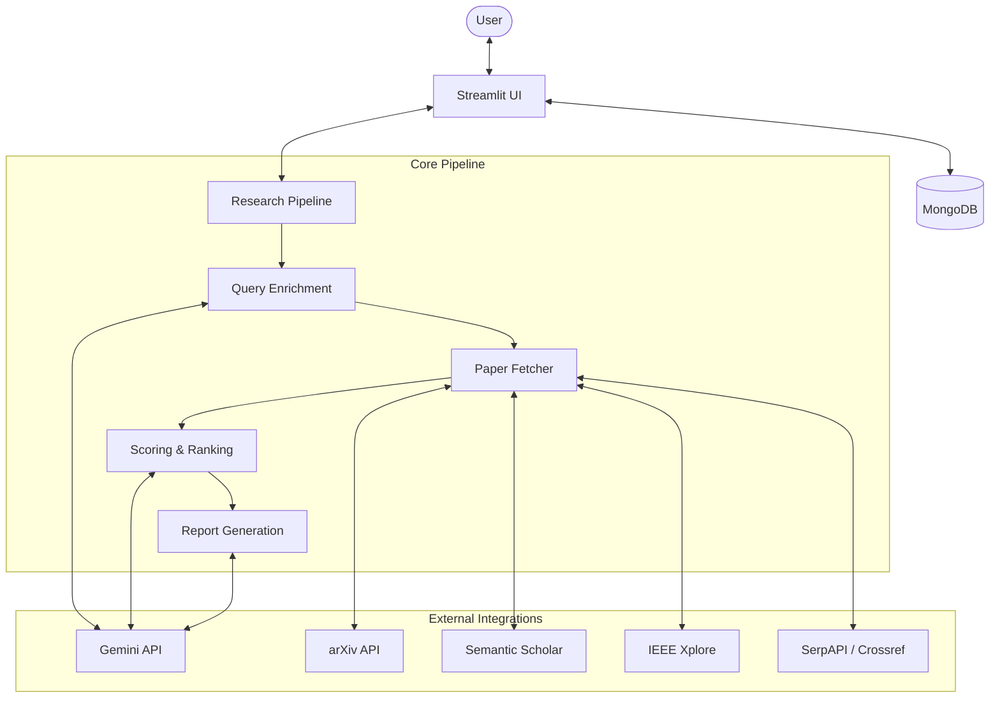

# 🔬 Scholarian: Deep Research Agent

> **Empowering academic research with Gemini-driven intelligence.**

Scholarian is a sophisticated, AI-powered research assistant designed to streamline the academic literature review process. By integrating multiple paper sources with Google's Gemini models, it automates the discovery, ranking, and synthesis of scholarly articles into comprehensive research reports.

---

## ✨ Features

- **Multi-Source Retrieval**: Fetches papers from Semantic Scholar, arXiv, Crossref, SerpAPI, and IEEE Xplore.
- **AI-Powered Query Enrichment**: Uses Gemini to expand a simple topic into a nuanced research query for better coverage.
- **Intelligent Scoring & Ranking**: Employs Gemini embeddings and metadata-based weights (Relevance, Citations, Recency) to rank papers.
- **Automated Report Generation**: Synthesizes top-ranked papers into a structured Markdown research report.
- **Interactive Refinement Loop**: Classify user feedback to refine reports, answer specific questions, or accept the final version.
- **Persistent Chat Storage**: Secure user authentication and chat history powered by MongoDB.
- **Export Capabilities**: Download reports as PDF, CSV, or JSON for further use.

---

## 🛠 Architecture

The project follows a modular structure, separating the UI layer from the core research logic.



### Project Structure

- **`app.py`**: The main entry point; handles the Streamlit UI and user session management.
- **`src/`**: Core logic directory.
  - **`pipeline.py`**: Orchestrates the high-level research flow.
  - **`ai.py`**: Interfaces with Gemini for LLM and Embedding tasks.
  - **`clients.py`**: API clients for various paper sources.
  - **`database.py`**: MongoDB interaction layer.
  - **`config.py`**: Application configuration and environment variable loading.
  - **`utils.py`**: Helper functions (e.g., Markdown-to-PDF conversion).

---

## 🚀 Getting Started

### Prerequisites

- **Python 3.9+**
- **MongoDB Instance** (Local or Atlas)
- **API Keys**:
  - [Google Gemini API Key](https://aistudio.google.com/) (Required)
  - [Semantic Scholar Key](https://www.semanticscholar.org/product/api) (Recommended)
  - [SerpAPI Key](https://serpapi.com/) (Optional)
  - [IEEE Xplore API Key](https://developer.ieee.org/) (Optional)

### Installation

1. **Clone the repository**:
   ```bash
   git clone https://github.com/Swpn0neel/deep-research-agent.git
   cd deep-research-agent
   ```

2. **Set up a virtual environment**:
   ```bash
   python -m venv venv
   # On Windows:
   venv\Scripts\activate
   # On macOS/Linux:
   source venv/bin/activate
   ```

3. **Install dependencies**:
   ```bash
   pip install -r requirements.txt
   ```

### Configuration

Create a `.env` file in the project root with the following variables:

```env
# Database
MONGO_URI="your_mongodb_connection_string"
MONGO_DBNAME="scholarian_db"

# Gemini AI (Minimum 1 recommended, supports rotation/backup)
GEMINI_API_KEY1="your_primary_gemini_key"
GEMINI_API_KEY2="your_secondary_gemini_key_optional"

# Research Providers
SEMANTIC_SCHOLAR_KEY="your_key"
SERPAPI_KEY="your_key"
IEEE_API_KEY="your_key"
```

---

## 📊 The Research Pipeline

### 1. Query Enrichment
The system doesn't just search for your raw topic. It uses Gemini to analyze the topic and generate an "enriched" query that includes technical keywords, synonyms, and sub-domains to maximize retrieval quality.

### 2. Paper Fetching
Concurrent requests are sent to multiple repositories. The results are dedupe-checked and normalized into a standard `Paper` model.

### 3. Scoring & Ranking
Papers are evaluated based on a composite score:
- **Relevance**: Cosine similarity between Gemini embeddings of the paper abstract and the enriched query.
- **Impact**: Normalized citation counts.
- **Recency**: Time-weighted decay based on the publication year.
> You can adjust the weights for these factors directly in the UI settings.

### 4. Synthesis
The top *K* papers are provided as context to Gemini, which generates a structured report covering background, methodology, current trends, and future directions.

---

## 💾 Data Management

- **Users**: Passwords are hashed using `bcrypt` before storage.
- **Chats**: Every research session is a "chat" document containing metadata, fetched paper logs, and the generated report.
- **Persistence**: Reports are strictly tied to the chat ID in MongoDB, ensuring you never lose your progress.

---


## 🤝 Contributing

Contributions are welcome! Please feel free to submit a Pull Request.

1. Fork the Project
2. Create your Feature Branch (`git checkout -b feature/AmazingFeature`)
3. Commit your Changes (`git commit -m 'Add some AmazingFeature'`)
4. Push to the Branch (`git push origin feature/AmazingFeature`)
5. Open a Pull Request

---

## ⚖️ License

Distributed under the MIT License. See `LICENSE` for more information.

---

<p align="center">
  Developed with ❤️ by <a href="https://github.com/Swpn0neel">Swapnoneel</a>
</p>
